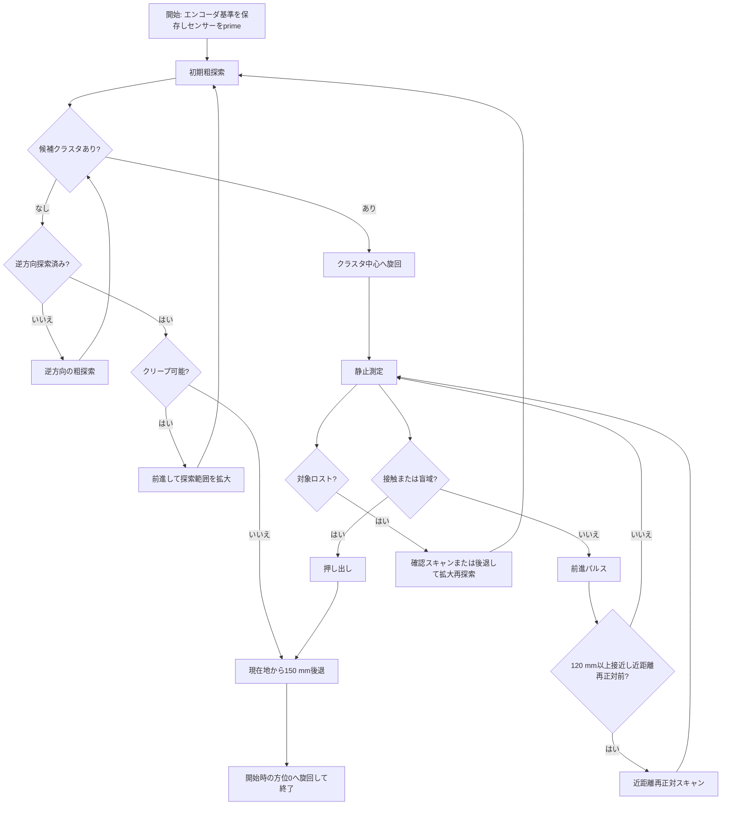
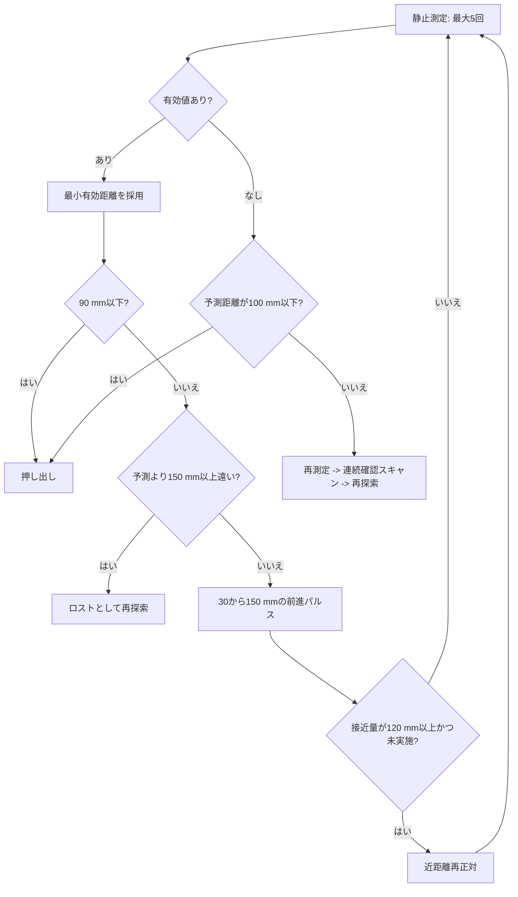

# UltrasonicAlignTracer 実装ガイド

`UltrasonicAlignTracer` は、SPIKE Prime の超音波センサー（PORT_F）でボトルを探索し、正対、接近、押し出し、退避するトレーサです。探索は約35度/sの連続往復旋回で行い、マルチパスのフェード位置を掃引します。

実装は [app/UltrasonicAlignTracer.h](../app/UltrasonicAlignTracer.h) と [app/UltrasonicAlignTracer.cpp](../app/UltrasonicAlignTracer.cpp) にあります。設定行の生成は [app.cpp](../app.cpp)、現在の実行設定は [tracer.ini](../tracer.ini) です。

## 起動と設定

`tracer.ini` に次の形式で1行を記述します。

```ini
UltrasonicAlignTracer <scan_half_angle_deg> <max_distance_mm> <push_distance_mm> \
                      [scan_turn_deg_per_sec] [approach_pwm] [push_pwm] \
                      [measure_hz] [scan_measure_hz]
```

現在の設定は次のとおりです。

```ini
UltrasonicAlignTracer 60 500 150 35 35 35 10 33
```

| 引数 | 現在値 | 意味 |
| --- | ---: | --- |
| `scan_half_angle_deg` | 60 | 初期探索の半角。正面を中心におよそ `+60deg -> -60deg` を往復探索する。 |
| `max_distance_mm` | 500 | 探索候補として受け入れる最大距離。DISTLの物理上限は2500 mm。 |
| `push_distance_mm` | 150 | 接触後に追加で押し出す距離。接触時に残っている距離も加算する。 |
| `scan_turn_deg_per_sec` | 35 | 走査旋回の目標速度。指定範囲は10〜90 deg/s。 |
| `approach_pwm` | 35 | 接近パルスと再探索前の後退に使うPWM。指定範囲は1〜100。 |
| `push_pwm` | 35 | 押し出しに使うPWM。指定範囲は1〜100。 |
| `measure_hz` | 10 | 静止測定と押出中の測距頻度。センサー更新に合わせ上限は10 Hz。 |
| `scan_measure_hz` | 33 | 走査中の読取り頻度。センサー更新より高くても新しい測距値が増えるわけではない。 |

最初の3引数は必須です。以降の5引数は左から順に省略でき、未指定時は表の現在値を使うため、従来の3引数形式との互換性があります。センサーがPORT_Fに存在しない場合、`app.cpp` はこのトレーサを登録せず、ログに理由を出力します。`tracer.ini` はビルド時にファームウェアへ埋め込まれるため、変更後は再ビルドが必要です。

## 全体フロー



`初期粗探索`と候補確認は約35度/sの連続往復旋回中に30 ms間隔で読み取ります。DISTLの実効更新は約100 msであり、読取り回数はピング回数ではありません。接近距離の更新時だけ停止し、80 ms整定後に約100 ms間隔で測定します。

## 探索と候補選別

### 粗探索

1. 開始時の左右エンコーダを保存し、方位と前進量の基準を作る。
2. `getDistance()` を1回呼び、距離モード切替を開始する（`sensor prime`）。
3. スキャン開始角へ旋回し、そこから反対側まで連続旋回する。
4. 有効な距離値を車体角約2度の方位ビンへ記録し、往路と復路のヒットを同じ配列へ累積する。
5. 1回以上ヒットしたビンを反射ありとする。連続ビンの距離中央値が最小の塊を候補にする。
6. 端に同じ値が続く影響を除いて中心角を求め、候補の前後30度を連続往復して確認する。

無反射ビンは物体間を接続しません。検出には多数決を使わず、エコーが1回でもあれば存在の強い証拠として残す1-of-M判定です。対象選択の距離代表値には外れ値に弱い最小値ではなく中央値を使います。

初回探索で候補がなければ、同じ範囲を逆方向に1回探索します。それでも見つからなければ、正面へ200 mm、次回250 mmと前進してから探索範囲を広げます。クリープは最大2回で、前進総量の上限もあります。

### 距離の有効性

有効距離の条件は次です。

$$50 \le d < 2500$$

- `d == -1`: DISTLが返す無反射値。ドライバエラーとは扱わない。
- `50 <= d < 2500`: 物理的なエコーあり。
- `d <= max_distance_mm`: 競技上の候補として採用する範囲。
- 900〜2000 mmの値も正当な測定値であり、捨てない。

## 接近と正対

候補クラスタの中心角まで旋回してから、停止して距離を測ります。測定後は一度に最大150 mm、最小30 mmのパルスで前進します。距離から120 mmを残すようにするため、センサー盲域に入る前に再測定できます。



予測距離は、最後に得た有効距離から、その後のエンコーダ前進量を引いて求めます。

$$d_{pred} = d_{last} - \frac{\Delta wheelDeg}{2.05}$$

### 近距離再正対

累計120 mm以上接近した時点で、現在の狙い方位の前後20度を再走査します。遠距離での探索中心と、近距離で実際にボトル面へ正対する角度はずれることがあるためです。

この再走査に限り、予測距離より150 mmを超えて遠い値を背景反射として除外します。

$$d_{near} \le \max(50, d_{pred} + 150)$$

これにより、ボトル接近後に床・壁などの遠い反射が近距離クラスタとして選ばれるのを防ぎます。値が取れない場合は、従来の方位を保って接近を継続します。

## ロスト時の回復

有効値が予測距離より150 mm以上遠い場合、または正常な無効測定が続く場合は対象をロストしたとみなします。

1. 最初は、現在方位の前後30度を約35度/sで連続往復確認する。
2. なお見つからなければ、予測距離が350 mmになるまで後退する。至近距離で旋回してボトルやアームに当たることを防ぐ。
3. 前後35度から開始し、試行ごとに範囲を拡大して再探索する。
4. 再探索は最大3回。回復できなければ押し出さず終了処理へ進む。

`-1`だけを根拠に前進するブラインドパルスは行いません。ただし、連続確認走査で得た直近の中央値から120 mmの余裕を残す最初のパルスは実行し、静止フェードの谷に入る前に接近します。最後の有効測定からの走行が100 mm以内で、予測距離も100 mm以下の場合だけ接触寸前と判断します。再探索前の退避は150 mmを目標に1回最大50 mmとし、再試行で大きく後退し続けないよう制限します。

## 押し出しと終了姿勢

距離が90 mm以下になるか、予測距離が100 mm以下で測定できなくなれば、接触直前とみなします。押し出し量は以下です。

$$push = pushDistance + remainingDistance$$

押し出し後、または探索失敗後は、終了した現在位置から150 mmだけ後退します。開始位置へ戻る制御ではありません。その後、開始方位を0として旋回復帰し、トレーサを終了します。

## 走行の補正

- 旋回時: エンコーダ差から方位を計算し、比例制御で左右を逆転させて旋回する。
- 前進・後退時: `Walker::runWithEncoderCorrection()` の左右エンコーダ補正を共通利用する。
- 方位保持: 前進中は現在方位と目標方位の差を左右PWMへ最大10だけ加減算する。
- 停動補償: 片輪のエンコーダ変化が続けて小さい場合、その片輪だけPWMを最大25まで段階的に増やす。

## 主なログ

| ログ | 意味 |
| --- | --- |
| `sensor prime` | センサーの距離モード初期化呼び出し。`raw=-1`でも直後の探索で回復し得る。 |
| `sweep hit` | 粗探索または近距離再正対中の有効距離。 |
| `cluster` | 方位ビンの範囲、中心角、距離中央値、ヒット数。 |
| `near align reject` | 近距離再正対で予測より遠く、背景反射として除外した値。 |
| `approach` | 静止測定の実測距離、予測距離、前進量。 |
| `blind contact` | センサー盲域に入ったと予測して押し出しへ移行。 |
| `lost` | 実測が予測より大幅に遠く、再探索へ移行。 |
| `backup before rescan` | 再探索前の安全後退。 |
| `return begin` / `returned` | 150 mm退避と初期方位復帰の開始・完了。 |

## 調整の優先順

1. まず`tracer.ini`の探索半角と最大距離を競技エリアに合わせ、壁など不要な反射を候補外にする。
2. 実機ログで`cluster`、`near align target`、`approach`の距離と角度の連続性を確認する。
3. 遠い背景を近距離再正対で拾う場合は`NEAR_ALIGN_FAR_TOLERANCE_MM`を小さくする。ボトルが大きく揺れる場合は大きくする。
4. ボトルを押し切れない場合だけ`push_distance_mm`を増やす。探索精度の問題を押し出し距離だけで補わない。

実測で検出可能圏が400〜600 mm程度に限られる場合は、ScenarioTracerまたはLineTracerで土俵手前まで接近してから本トレーサを開始してください。センサー取付位置は大会規約に従い固定し、計測のために変更しません。
