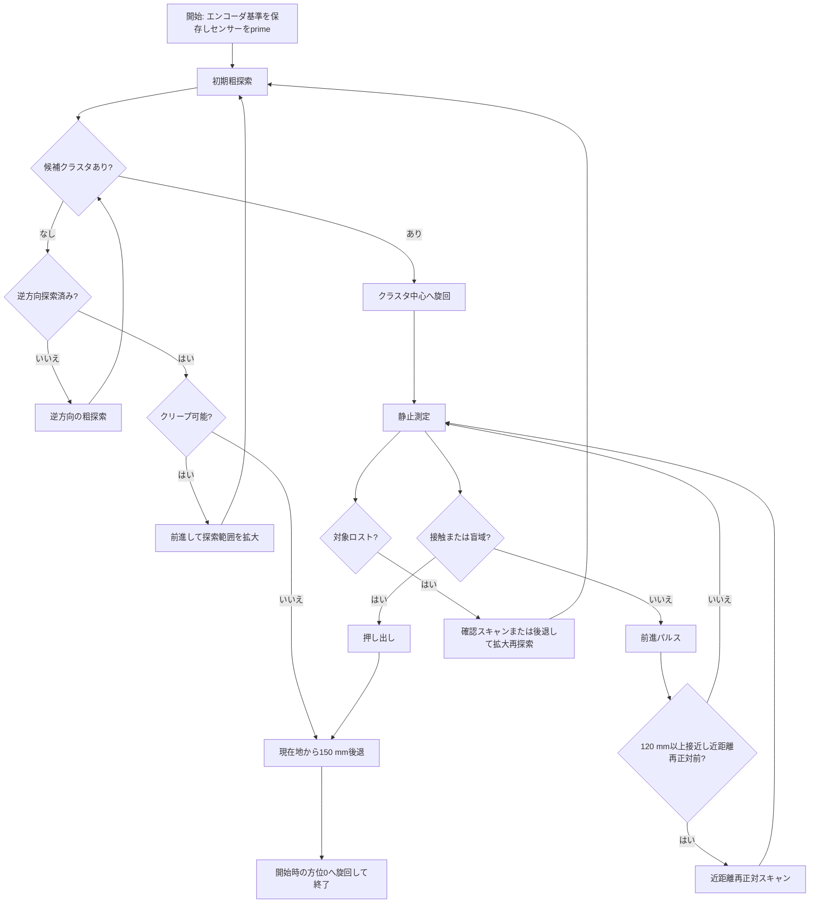
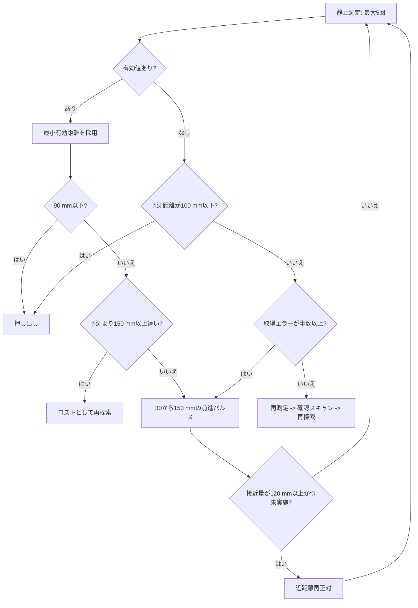

# UltrasonicAlignTracer 実装ガイド

`UltrasonicAlignTracer` は、SPIKE Prime の超音波センサー（PORT_F）でボトルを探索し、正対、接近、押し出し、退避するトレーサです。走行中の距離値を信頼せず、原則として「移動または旋回 -> ブレーキ -> 整定 -> 測定」を繰り返します。

実装は [app/UltrasonicAlignTracer.h](../app/UltrasonicAlignTracer.h) と [app/UltrasonicAlignTracer.cpp](../app/UltrasonicAlignTracer.cpp) にあります。設定行の生成は [app.cpp](../app.cpp)、現在の実行設定は [tracer.ini](../tracer.ini) です。

## 起動と設定

`tracer.ini` に次の形式で1行を記述します。

```ini
UltrasonicAlignTracer <scan_half_angle_deg> <max_distance_mm> <push_distance_mm>
```

現在の設定は次のとおりです。

```ini
UltrasonicAlignTracer 120 1000 130
```

| 引数 | 現在値 | 意味 |
| --- | ---: | --- |
| `scan_half_angle_deg` | 120 | 初期探索の半角。正面を中心におよそ `+120deg -> -120deg` を探索する。 |
| `max_distance_mm` | 1000 | 探索候補として受け入れる最大距離。センサーの無効センチネルを除くため、実際の上限は899 mm。 |
| `push_distance_mm` | 130 | 接触後に追加で押し出す距離。接触時に残っている距離も加算する。 |

センサーがPORT_Fに存在しない場合、`app.cpp` はこのトレーサを登録せず、ログに理由を出力します。`tracer.ini` はビルド時にファームウェアへ埋め込まれるため、変更後は再ビルドとアップロードが必要です。

## 全体フロー



`初期粗探索`は高速な連続旋回中に30 ms間隔で測定します。静止測定が必要な局面では、旋回または前進を止めて80 ms整定した後、約100 ms間隔で測定します。

## 探索と候補選別

### 粗探索

1. 開始時の左右エンコーダを保存し、方位と前進量の基準を作る。
2. `getDistance()` を1回呼び、距離モード切替を開始する（`sensor prime`）。
3. スキャン開始角へ旋回し、そこから反対側まで連続旋回する。
4. 有効な距離値を、角度が連続した反応帯である「クラスタ」として蓄積する。
5. 最も近いクラスタを候補にし、反応帯の端に重複した同値が続く影響を除いて中心角を求める。

クラスタ内では、最小距離との差が80 mm以内の値を同じ対象として扱います。負値の取得エラーが約10度以内に短く挟まった場合は、クラスタを切らずに次の値を待ちます。

初回探索で候補がなければ、同じ範囲を逆方向に1回探索します。それでも見つからなければ、正面へ200 mm、次回250 mmと前進してから探索範囲を広げます。クリープは最大2回で、前進総量の上限もあります。

### 距離の有効性

有効距離の条件は次です。

$$25 \le d < \min(\text{max_distance_mm}, 900)$$

- `d < 0`: PUPドライバの取得エラー。無反射とは区別する。
- `d >= 900`: エコーなしのセンチネル付近として無効扱い。
- 300 mmの上限は存在しない。`EARLY_ACCEPT_MM = 320`は近い候補を早く確定して探索を打ち切るための閾値であり、300 mm超を除外しない。

## 接近と正対

候補クラスタの中心角まで旋回してから、停止して距離を測ります。測定後は一度に最大150 mm、最小30 mmのパルスで前進します。距離から120 mmを残すようにするため、センサー盲域に入る前に再測定できます。



予測距離は、最後に得た有効距離から、その後のエンコーダ前進量を引いて求めます。

$$d_{pred} = d_{last} - \frac{\Delta wheelDeg}{2.05}$$

### 近距離再正対

累計120 mm以上接近した時点で、現在の狙い方位の前後20度を再走査します。遠距離での探索中心と、近距離で実際にボトル面へ正対する角度はずれることがあるためです。

この再走査に限り、予測距離より150 mmを超えて遠い値を背景反射として除外します。

$$d_{near} \le \max(25, d_{pred} + 150)$$

これにより、ボトル接近後に床・壁などの遠い反射が近距離クラスタとして選ばれるのを防ぎます。値が取れない場合は、従来の方位を保って接近を継続します。

## ロスト時の回復

有効値が予測距離より150 mm以上遠い場合、または正常な無効測定が続く場合は対象をロストしたとみなします。

1. 最初は、現在方位の前後25度で静止確認スキャンを行う。
2. なお見つからなければ、予測距離が350 mmになるまで後退する。至近距離で旋回してボトルやアームに当たることを防ぐ。
3. 前後35度から開始し、試行ごとに範囲を拡大して再探索する。
4. 再探索は最大3回。回復できなければ押し出さず終了処理へ進む。

負値が測定回数の半数以上を占める場合はドライバエラーとみなし、既知の方位と予測距離に基づいて次の前進パルスへ進みます。探索全体で距離を捏造するのではなく、すでに対象を確定した接近局面だけで補完します。

## 押し出しと終了姿勢

距離が90 mm以下になるか、予測距離が100 mm以下で測定できなくなれば、接触直前とみなします。押し出し量は以下です。

$$push = pushDistance + remainingDistance$$

押し出し後、または探索失敗後は、終了した現在位置から150 mmだけ後退します。開始位置へ戻る制御ではありません。その後、開始方位を0として旋回復帰し、トレーサを終了します。

## 走行の補正

- 旋回時: エンコーダ差から方位を計算し、比例制御で左右を逆転させて旋回する。
- 前進・後退時: `Walker::runStraight()` の左右エンコーダ補正を共通利用する。
- 方位保持: 前進中は現在方位と目標方位の差を左右PWMへ最大10だけ加減算する。
- 停動補償: 片輪のエンコーダ変化が続けて小さい場合、その片輪だけPWMを最大25まで段階的に増やす。

## 主なログ

| ログ | 意味 |
| --- | --- |
| `sensor prime` | センサーの距離モード初期化呼び出し。`raw=-1`でも直後の探索で回復し得る。 |
| `sweep hit` | 粗探索または近距離再正対中の有効距離。 |
| `cluster` | 反応帯から選んだ候補の中心角と最短距離。 |
| `near align reject` | 近距離再正対で予測より遠く、背景反射として除外した値。 |
| `approach` | 静止測定の実測距離、予測距離、前進量。 |
| `blind contact` | センサー盲域に入ったと予測して押し出しへ移行。 |
| `lost` | 実測が予測より大幅に遠く、再探索へ移行。 |
| `backup before rescan` | 再探索前の安全後退。 |
| `return begin` / `returned` | 150 mm退避と初期方位復帰の開始・完了。 |

## 調整の優先順

1. まず`tracer.ini`の探索半角と最大距離を競技エリアに合わせ、壁など不要な反射を候補外にする。
2. 実機ログで`cluster`、`near align target`、`approach`の距離と角度の連続性を確認する。
3. 遠い背景を近距離再正対で拾う場合は`NEAR_ALIGN_FAR_TOLERANCE_MM`を小さくする。ボトルが大きく揺れる場合は大きくする。
4. ボトルを押し切れない場合だけ`push_distance_mm`を増やす。探索精度の問題を押し出し距離だけで補わない。
