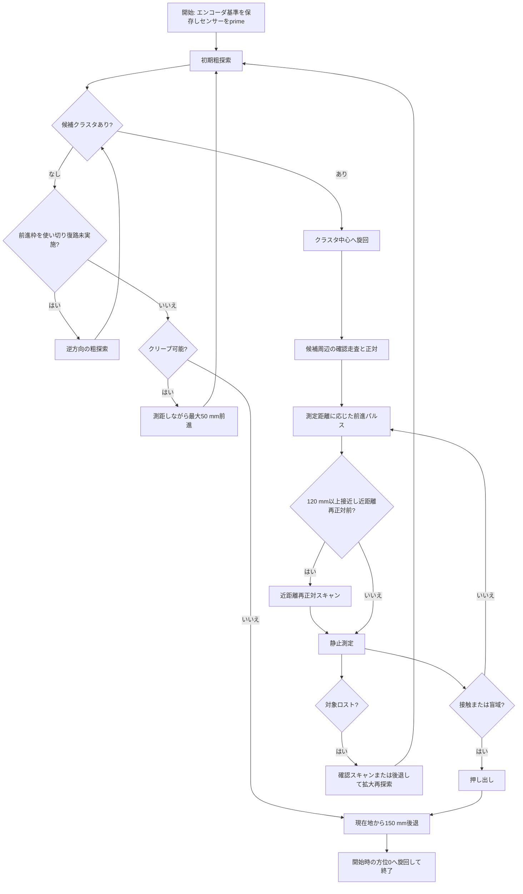
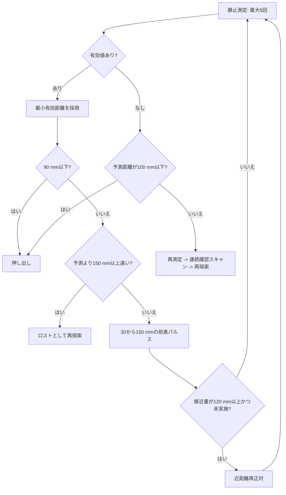

近距離走査の候補が、それまでの狙い方位から10度を超える変更となる場合に限り、復路でも角度を確認します。往路のヒットは復路の候補選択に使わず、復路だけで得た候補が往路候補から5度以内なら採用します。往復が不一致でも、復路候補が元の接近方位から10度以内なら、小さな補正として復路の方位と距離を採用します。この場合は `near correction keep heading` を記録します（元の方位へ固定する意味ではありません）。復路が未検知、または往復不一致かつ元の接近方位からも10度を超える場合は、追加前進せず下記の後退復帰へ移行します。エコーの存在判定は1-of-Mを維持し、大きな方位変更の採用だけを別に確認する方式です。10度・5度は暫定の判断閾値であり、センサーの保証精度ではありません。10度以下の補正は従来どおり片道で進むため、成功時の復路を一律には増やしません。
# UltrasonicAlignTracer 実装ガイド

`UltrasonicAlignTracer` は、SPIKE Prime の超音波センサー（PORT_F）でボトルを探索し、正対、接近、押し出し、退避するトレーサです。探索は目標35度/sの連続旋回で行います。片道で候補が得られれば復路を省略します。実際の速度と検出率の関係は実機評価が必要です。

実装は [app/UltrasonicAlignTracer.h](../app/UltrasonicAlignTracer.h) と [app/UltrasonicAlignTracer.cpp](../app/UltrasonicAlignTracer.cpp) にあります。設定行の生成は [app.cpp](../app.cpp)、現在の実行設定は [tracer.ini](../tracer.ini) です。

## 起動と設定

`tracer.ini` に次の形式で1行を記述します。

```ini
UltrasonicAlignTracer <scan_half_angle_deg> <max_distance_mm> <push_distance_mm> \
                      [scan_turn_deg_per_sec] [approach_pwm] [push_pwm] \
                      [measure_hz] [scan_measure_hz]
```

設定例は次のとおりです（実行中の値は `tracer.ini` と起動ログで確認してください）。

```ini
UltrasonicAlignTracer 60 500 150 35 35 35 10 33
```

| 引数 | 例の値 | 意味 |
| --- | ---: | --- |
| `scan_half_angle_deg` | 60 | 探索の半角。正面を中心におよそ `+60deg -> -60deg` を探索する。 |
| `max_distance_mm` | 500 | 探索候補として受け入れる最大距離。DISTLの物理上限は2500 mm。 |
| `push_distance_mm` | 150 | 接触後に追加で押し出す距離。接触時に残っている距離も加算する。 |
| `scan_turn_deg_per_sec` | 35 | 走査旋回の目標速度。指定範囲は10〜90 deg/s。 |
| `approach_pwm` | 35 | 接近パルスと再探索前の後退に使うPWM。指定範囲は1〜100。 |
| `push_pwm` | 35 | 押し出しに使うPWM。指定範囲は1〜100。 |
| `measure_hz` | 10 | 静止測定と押出中の測距頻度。センサー更新に合わせ上限は10 Hz。 |
| `scan_measure_hz` | 33 | 走査中の読取り頻度。センサー更新より高くても新しい測距値が増えるわけではない。 |

最初の3引数は必須です。以降の5引数は左から順に省略でき、未指定時は表の例の値を使うため、従来の3引数形式との互換性があります。センサーがPORT_Fに存在しない場合、`app.cpp` はこのトレーサを登録せず、ログに理由を出力します。`tracer.ini` はビルド時にファームウェアへ埋め込まれるため、変更後は再ビルドが必要です。

## 全体フロー



初期粗探索は設定された速度、候補確認と近距離正対は `min(設定速度, 35)` 度/sを目標とします。75度/s指定でも正対用の走査は35度/sです。これは高速探索と正対精度を両立する比較用設定であり、最適速度は未確定です。30 ms間隔の読取りはDISTLの実効更新（約100 ms）より速く、読取り回数はピング回数ではありません。接近距離の更新時だけ停止し、80 ms整定後に100 ms間隔で測定します（10 ms制御周期、10 Hz設定時）。

## 探索と候補選別

### 粗探索

1. 開始時の左右エンコーダを保存し、方位と前進量の基準を作る。
2. `getDistance()` を1回呼び、距離モード切替を開始する（`sensor prime`）。
3. スキャン開始角へ旋回し、そこから反対側まで連続旋回する。
4. 有効な距離値を車体角約2度の方位ビンへ記録する。復路を実施する場合は同じ配列へ累積する。
5. 1回以上ヒットしたビンを反射ありとする。連続ビンの距離中央値が最小の塊を候補にする。同じ中央値の候補は走査中心に近い方を選び、配列先頭の負角側へ偏ることを防ぐ。初期探索では正面、確認・近距離探索ではそれまでの狙い方位が基準となる。
6. 端に同じ値が続く影響を除いて中心角を求め、候補の前後30度を連続旋回して確認する。確認走査でも片道で候補が得られれば復路を省略する。

無反射ビンは物体間を接続しません。検出には多数決を使わず、エコーが1回でもあれば存在の強い証拠として残す1-of-M判定です。対象選択の距離代表値には外れ値に弱い最小値ではなく中央値を使います。

初期探索で候補がなければ、開始方位へ戻り最大50 mmだけ前進します。1〜4回目の前進後は設定半角で探索し、5回目の前進完了後だけ半角を少なくとも90度（140 wheelDeg）へ広げます。斜めに置かれた対象が前進によって側方へ回り込む場合への対策です。クリープは最大5回、指令距離の合計は最大250 mmで、従来の100+150 mmから増やしていません。最後の位置では未検知なら復路も試してから終了します。広げた範囲に別の対象がないことを確認してください。実走行には停止遅れと滑りがあるため、250 mmは物理的な安全境界を保証しません。

`creep` は前進の計画であり、直後は開始方位への旋回です。`creep drive begin` はその旋回が完了して前進処理へ移る時点の回数・走行量・方位を記録します。`translated search` は前進完了後の探索です。タスクログも同時に途絶えた場合は、これらの最後の記録だけでモーター停止や通信停止の原因を断定できません。

クリープ中も通常の測定頻度で測距し、候補を捕捉したら前進を止めます。150 mmより遠ければ周辺を確認走査し、150 mm以下ならその場で広く旋回せず接近処理へ進みます。クリープ中も既存の全体前進上限を確認します。エンコーダ平均は走行量であり、旋回を含む二次元位置や土俵端までの距離ではありません。前方にボトルが存在し得る、かつクリープ可能な競技配置でのみ使用してください。

### 接近前の再探索短縮

接近前の候補確認が往復とも未検知の場合は、次の条件をすべて満たすと同位置での追加再探索を省き、開始方位へ戻って測距付き50 mmクリープへ移ります。

- このトレーサでまだ接近処理を開始していない。クリープは接近処理とは区別する。
- 最後の有効距離から走行量を差し引いた予測距離が200 mmより大きい（50 mm前進後も150 mm超を残す計算）。
- クリープ回数が5回未満で、次の50 mm指令が既存の全体前進上限内に収まる。

ログは `target verify found nothing; translate: predicted=... next=50mm`。条件を満たさなければ従来の再探索・安全後退へ進みます。後退回復中の未検知は既存どおり終了処理を優先します。距離は予測値であり、土俵端・別物体・滑りを含めた前進の安全性を保証しません。クリープ総枠は増やさず、近距離正対の復路確認、後退距離、速度設定も変更しません。

### 距離の有効性

有効距離の条件は次です。

$$50 \le d < 2500$$

- `d == -1`: DISTLが返す無反射値。ドライバエラーとは扱わない。
- `50 <= d < 2500`: 物理的なエコーあり。
- `d <= max_distance_mm`: 競技上の候補として採用する範囲。
- 900〜2000 mmの値も正当な測定値であり、捨てない。

## 接近と正対

確認走査の候補クラスタ中心角まで旋回したら、得られた距離から最初の前進パルスを決めます。その後は停止測定と前進を繰り返します。一度に最大150 mm、最小30 mmのパルスで、距離から120 mmを残す長さを基本にします。



予測距離は、最後に得た有効距離から、その後のエンコーダ前進量を引いて求めます。

$$d_{pred} = d_{last} - \frac{\Delta wheelDeg}{2.05}$$

### 近距離再正対

累計120 mm以上接近した時点で、現在の狙い方位の前後20度を再走査します。遠距離での探索中心と、近距離で実際にボトル面へ正対する角度はずれることがあるためです。

近距離走査の候補が、それまでの狙い方位から10度を超える変更となる場合に限り、復路でも角度を確認します。往路のヒットは復路の候補選択に使わず、復路だけで得た候補が往路候補から5度以内なら採用します。未検知・不一致なら追加前進せず、下記の後退復帰へ移行します。エコーの存在判定は1-of-Mを維持し、大きな方位変更の採用だけを別に確認する方式です。10度・5度は暫定の判断閾値であり、センサーの保証精度ではありません。10度以下の補正は従来どおり片道で進むため、成功時の復路を一律には増やしません。

`fine=1 target=35deg/s` は指令値です。実機ではPWM下限22でも57度/sとなった区間があり、実速度35度/sを保証しません。復路確認で切り分けた後、下限PWMと起動時の加速を別途評価します。

この再走査に限り、予測距離より150 mmを超えて遠い値を背景反射として除外します。

$$d_{near} \le \max(50, d_{pred} + 150)$$

これにより、ボトル接近後に床・壁などの遠い反射が近距離クラスタとして選ばれるのを防ぎます。往復とも値が取れない場合は、接近してきた方位へ戻って停止し、直前のパルスの走行量だけ（最大150 mm）後退して全範囲を再探索します。走査終了時の横向きのまま後退しません。後退後の再探索でも未検知なら追加クリープは行わず終了処理へ進みます。エンコーダで経路を戻すため、滑り・旋回ずれ・停止遅れによる実位置差は残ります。

## ロスト時の回復

有効値が予測距離より150 mm以上遠い場合、または正常な無効測定が続く場合は対象をロストしたとみなします。

1. 最初は、現在方位の前後30度を約35度/sで連続往復確認する。
2. なお見つからなければ、予測距離が150 mmより近い場合のみ1回最大50 mm後退する。至近距離で旋回してボトルやアームに当たることを防ぐ。
3. 前後35度から開始し、試行ごとに範囲を拡大して再探索する。
4. 再探索の往復でも候補がなければ、古い距離の予測を破棄し、残っているクリープ枠で開始方位へ前進して再捕捉を試す。前進枠は初期探索と共有し、使い切ったら終了する。再探索開始回数の上限3回も維持する。

`-1`だけを根拠に前進するブラインドパルスは行いません。ただし、連続確認走査で得た直近の中央値から120 mmの余裕を残す最初のパルスは実行し、静止フェードの谷に入る前に接近します。最後の有効測定からの走行が100 mm以内で、予測距離も100 mm以下の場合だけ接触寸前と判断します。再探索前の退避は150 mmを目標に1回最大50 mmとし、再試行で大きく後退し続けないよう制限します。

接近開始時に古い距離の取得位置を更新しません。取得位置から100 mmを超えて移動している場合は古い距離から直ちにパルスを開始せず、停止測定に戻ります。100 mm以内でも移動量を引いてパルスを決めます。

押し出し中に240 mmを超える物理的に有効な反射を検出した場合は100 mm後退して再探索します。候補採用上限（例: 500 mm）を超えた反射も対象です。近距離走査失敗からの後退と共有で最大3回までとし、後退後の再探索が未検知なら終了します。終了処理には別途150 mm後退があるため、回復後退と合わせた後方の余裕が必要です。

押し出し中の `-1` のみでは自動後退しません。至近距離の盲域と通過によるロストを現在の距離APIだけでは確定できないためです。`push sample` に測定頻度で生値と走行量を残し、正常な押し出しと押し外しを比較して判定条件を決めます。このため、無反射だけで通過するケースの自動復帰は未対応です。

## 押し出しと終了姿勢

距離が90 mm以下になるか、予測距離が100 mm以下で測定できなくなれば、接触直前とみなします。押し出し量は以下です。

$$push = pushDistance + remainingDistance$$

押し出し後、または探索失敗後は、終了した現在位置から150 mmだけ後退します。開始位置へ戻る制御ではありません。その後、開始方位を0として旋回復帰し、トレーサを終了します。

## 走行の補正

- 旋回時: エンコーダ差から方位を計算する。旋回開始時の左右車輪角の合計を保持する共通PWM補正（最大10）で、左右の回転量の不均衡による並進ずれを抑える。タイヤの滑りによる実位置ずれまでは補正できない。
- 前進・後退時: `Walker::runWithEncoderCorrection()` の左右エンコーダ補正を共通利用する。
- 方位保持: 前進中は現在方位と目標方位の差を左右PWMへ最大10だけ加減算する。
- 停動補償: 片輪のエンコーダ変化が続けて小さい場合、その片輪だけPWMを最大25まで段階的に増やす。

## 主なログ

| ログ | 意味 |
| --- | --- |
| `sensor prime` | センサーの距離モード初期化呼び出し。`raw=-1`でも直後の探索で回復し得る。 |
| `sweep hit` | 粗探索または近距離再正対中の有効距離。 |
| `cluster` | 方位ビンの範囲、中心角、距離中央値、ヒット数。 |
| `near align reject` | 近距離再正対で予測より遠く、背景反射として除外した値。 |
| `approach` | 静止測定の実測距離、予測距離、前進量。 |
| `blind contact` | センサー盲域に入ったと予測して押し出しへ移行。 |
| `lost` | 実測が予測より大幅に遠く、再探索へ移行。 |
| `backup before rescan` | 再探索前の安全後退。 |
| `sweep summary` | 往復方向、読取りの有効・無反射数、走査制御周期数 `ticks`、エンコーダ平均の変化 `drift`、累積平均 `forward`。距離換算は車輪角/2.05。実時間はPCログの時刻でも比較する。 |
| `creep` / `translated search` | 前進回数・指令距離、前進後の走査範囲。 |
| `creep hit` | 前進中に捕捉して停止した距離・走行量・方位。 |
| `return begin` / `returned` | 150 mm退避と初期方位復帰の開始・完了。 |

## 調整の優先順

1. まず`tracer.ini`の探索半角と最大距離を競技エリアに合わせ、壁など不要な反射を候補外にする。
2. 実機ログで`cluster`、`near align target`、`approach`の距離と角度の連続性を確認する。
3. 遠い背景を近距離再正対で拾う場合は`NEAR_ALIGN_FAR_TOLERANCE_MM`を小さくする。ボトルが大きく揺れる場合は大きくする。
4. ボトルを押し切れない場合だけ`push_distance_mm`を増やす。探索精度の問題を押し出し距離だけで補わない。

検出可能圏が約300 mmに限られる場合は、競技配置から安全な接近位置を決め、ScenarioTracerまたはLineTracerでそこまで接近してから本トレーサを開始する方法も比較してください。センサー取付位置は大会規約に従い固定し、計測のために変更しません。

## 回帰テスト

リポジトリ内の `tests/ultrasonic_align_test.cpp` は、センサーとモーターを置き換えて実装本体の制御遷移を検証します。物理的な検出率や滑りは再現しません。`~/etrobo` で実行します。

```sh
g++ -std=c++17 -O1 -Wall -Wextra -Werror -fsanitize=address,undefined \
    -Iworkspace/EtRobocon2026/unit -Ispike-rt/drivers/include/libcpp/spike \
    workspace/EtRobocon2026/tests/ultrasonic_align_test.cpp \
    -o /tmp/etrobo-ultrasonic-align-test
/tmp/etrobo-ultrasonic-align-test
make app=EtRobocon2026
```

GCC 13の `-O2 -Werror` では既存の短い配列に対する `std::sort` で境界警告が発生するため、ホスト検証は `-O1` を使用します。
`make app=EtRobocon2026 up` はコンパイルに加えてUSB経由の実機書き込みも行います。
